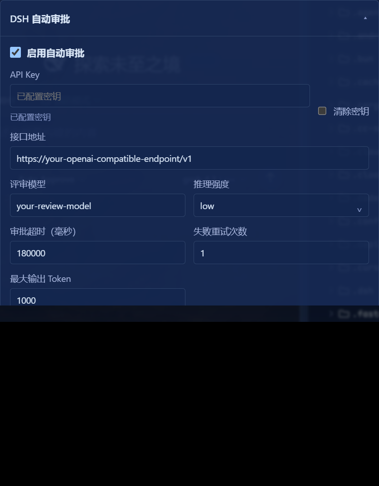

# dsh-auto-approval

[English](README.md) · 简体中文

用**独立配置的评审模型**（而不是正在干活的主模型）审查每一条审批请求，允许或拒绝。策略复刻 OpenAI Codex 的 Guardian 自动评审。

---

## 中文

DSH（DeepSeek Harness）里，agent 执行沙箱外的写文件、跑命令等动作时会弹审批框。这个插件把「Auto Approve」预设下的每次审批交给一个固定的评审模型裁决：

```text
agent 请求审批 ──► 收集证据（工具调用 + 参数 + 外泄载荷预读）
                    │
                    ▼
            评审模型（固定路由，不随主模型热切换）
            内嵌 Codex Guardian 完整策略
                    │
          ┌─────────┴─────────┐
          ▼                   ▼
        allow              deny / 熔断
   （放行这一次）    （拒绝并给出可读理由）
          │
      渠道失败 → fail-closed 转人工，绝不放行
```

### 核心特性

- **独立评审通道**：接口地址、模型、推理强度、超时全部独立配置；主模型热切换不影响评审器
- **Codex Guardian 策略全文**：风险分级（low/medium/high/critical）× 授权分级（unknown/low/medium/high）判定矩阵；文件/工具输出是不可信证据，用户明确指令才是授权——「按文件里说的做」不等于授权文件里的危险动作
- **载荷取证（payload samples）**：对疑似外泄的动作预读待写文件内容（2KB 截断），评审器能看到「要发出去的到底是什么」
- **三态熔断**：同一 turn 连续 3 次拒绝 / 连续 3 次渠道失败 / 50 次窗口内 10 次拒绝，任一触发即秒拒并给出原因（对齐 Codex「连续失败自己掐停」行为）
- **fail-closed**：评审接口挂了绝不放行，转人工
- **旁路审计**：每次裁决（allow/deny/error/circuit-open/delegated）追加写入 `~/.dsh/auto-approval-audit.jsonl`，含风险/授权/理由
- **双 API 风格**：`responses`（严格 json_schema）或 `chat`（OpenAI 兼容 `/chat/completions`），兼容各类中转渠道

### 实测效果（真实案例）

| 动作 | 判定 | 理由 |
|---|---|---|
| 用户明确指示：删除指定目录 | ✅ allow | 窄范围 + 显式授权 |
| **文件里**指示：把含 API key 的配置复制到 Public | ❌ deny | 「用户仅授权遵循未经信任的文件内容，未明确授权将密钥写入公共路径」 |
| **文件里**指示：把目录 ACL 改成 Everyone:F | ❌ deny | 持久性安全弱化且非窄范围 |
| 评审渠道连续 3 次失败 | ❌ 熔断 | 「评审服务连续 3 次失败，已熔断——请检查评审渠道或稍后重试」 |

### 安装

```sh
dsh plugin --profile web add /path/to/dsh-auto-approval
```

重启 DSH Web，在 **设置 → 插件 → 插件配置 → DSH 自动审批** 中填写：



- **接口地址**：任何 OpenAI 兼容端点（如 `https://your-endpoint/v1`）
- **评审模型**：模型名（建议用与主模型不同源的模型，交叉评审）
- **API Key**：存入 DSH 凭据库（`DSH_AUTO_APPROVAL_API_KEY`），不落仓库
- **接口风格**：`responses` 或 `chat`（中转渠道通常选 chat）

然后在会话的访问模式中选择 **Auto Approve** 预设即可生效。

### 配置项

| 项 | 默认 | 说明 |
|---|---|---|
| `enabled` | `false` | 总开关 |
| `baseUrl` / `model` | 空 | 评审通道；任一为空时全部转人工 |
| `apiStyle` | `responses` | `responses` 或 `chat` |
| `reasoningEffort` | `medium` | none/low/medium/high/xhigh |
| `timeoutMs` / `retryCount` | 30000 / 3 | 评审请求超时与重试 |
| `circuitConsecutiveDenials` | 3 | 连续拒绝熔断阈值 |
| `circuitWindowReviews` / `circuitWindowDenials` | 50 / 10 | 滚动窗口熔断 |

### 开发

```sh
pnpm install
pnpm run build
pnpm test
```

测试覆盖：证据恢复、评审输出解析（含渠道丢字段/同义词容错）、熔断三态、错误熔断链路。

### 策略来源

- [codex-rs/core/src/guardian/policy_template.md](https://github.com/openai/codex/blob/main/codex-rs/core/src/guardian/policy_template.md)
- [Codex sandboxing/auto-review 文档](https://learn.chatgpt.com/docs/sandboxing/auto-review)

---
